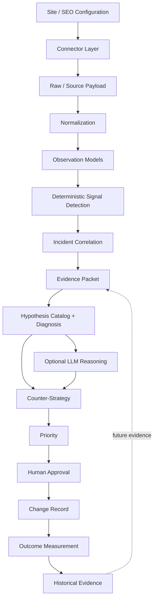

# SEO Daily Counter-Strategy System

A reusable backend decision system that turns heterogeneous SEO observations into reproducible signals, correlated incidents, evidence-backed diagnosis, structured counter-strategies, human approval records, and measurable outcomes.

> **V1 principle:** deterministic observation and detection first; constrained AI reasoning second.  
> **V1 execution boundary:** read-only with respect to production. The system records approvals and changes but does not autonomously modify production.

## 1. Project Purpose

The system is designed around the operating loop:

**OBSERVE → VERIFY → CORRELATE → DIAGNOSE → PRIORITIZE → APPROVE → SHIP → RE-MEASURE**

The architecture specification defines Google Search Console (GSC) as the primary source of search-performance truth and GA4 as downstream traffic/conversion/revenue truth. Third-party measurements are supporting evidence rather than automatic ground truth.

The implementation in this repository contains the core backend layers for:

- site and canonical data models
- connector abstractions and GSC mock/real connectors
- observation normalization
- deterministic search-performance signal detection
- incident correlation
- evidence packet construction
- controlled SEO hypothesis catalog
- deterministic diagnosis
- optional OpenAI-compatible LLM diagnosis
- structured action recommendations
- transparent priority scoring
- human approval/reject/defer handling
- change records
- outcome measurements

## 2. Architecture



The implementation keeps provider collection, deterministic detection, diagnosis, strategy, and outcome responsibilities separated instead of placing them in one orchestration layer.

## 3. Repository Structure

```text
seo-counter-strategy/
├── backend/
│   ├── app/
│   │   ├── api/
│   │   │   ├── changes.py
│   │   │   └── outcomes.py
│   │   ├── connectors/
│   │   │   ├── base.py
│   │   │   ├── factory.py
│   │   │   ├── gsc.py
│   │   │   └── gsc_real.py
│   │   ├── core/
│   │   │   ├── config.py
│   │   │   └── storage.py
│   │   ├── diagnosis/
│   │   │   ├── catalog.py
│   │   │   ├── engine.py
│   │   │   ├── evidence.py
│   │   │   ├── llm.py
│   │   │   └── llm_client.py
│   │   ├── models/
│   │   │   ├── action.py
│   │   │   ├── approval.py
│   │   │   ├── change.py
│   │   │   ├── evidence.py
│   │   │   ├── hypothesis.py
│   │   │   ├── incident.py
│   │   │   ├── observation.py
│   │   │   ├── outcome.py
│   │   │   ├── signal.py
│   │   │   └── site.py
│   │   ├── outcomes/
│   │   │   ├── change_registry.py
│   │   │   ├── change_service.py
│   │   │   ├── measurement.py
│   │   │   ├── outcome_registry.py
│   │   │   └── registry.py
│   │   ├── pipeline/
│   │   │   ├── correlator.py
│   │   │   ├── detector.py
│   │   │   └── normalizer.py
│   │   ├── strategy/
│   │   │   ├── actions.py
│   │   │   ├── approval.py
│   │   │   └── priority.py
│   │   └── main.py
│   ├── tests/
│   │   ├── test_approval.py
│   │   ├── test_change.py
│   │   ├── test_connectors.py
│   │   ├── test_correlation.py
│   │   ├── test_detection.py
│   │   ├── test_diagnosis.py
│   │   ├── test_evidence.py
│   │   ├── test_hypothesis_catalog.py
│   │   ├── test_llm_client.py
│   │   ├── test_llm_contract.py
│   │   ├── test_normalization.py
│   │   ├── test_outcomes.py
│   │   ├── test_site.py
│   │   └── test_strategy.py
│   ├── .env.example
│   ├── pytest.ini
│   └── requirements.txt
├── README.md
└── HANDOVER.md
```

## 4. Implemented Pipeline

### 4.1 Connectors

The connector abstraction provides a common conceptual boundary for external data sources. The current repository contains:

- GSC mock connector for deterministic fixture-based development
- GSC real connector using Google APIs/service-account credentials
- connector factory

The architecture assigns source authority by tier:

| Source | Role | Authority |
|---|---|---|
| Google Search Console | Search queries, clicks, impressions, CTR, position, search/indexing evidence | T1 search truth |
| Google Analytics 4 | Traffic, conversions, revenue/downstream impact | T0 business truth |
| Uptime / crawler | Site and technical observations | T2 site truth |
| Rank/backlink/competitor/other external providers | Supporting measurements | T3 external measurement |

Missing or stale data should remain an explicit state rather than silently becoming zero.

### 4.2 Normalization

`app/pipeline/normalizer.py` converts source payloads into canonical `Observation` objects. The model retains source information, timestamps, freshness/status information, provenance, and dimensional context.

### 4.3 Deterministic Detection

`app/pipeline/detector.py` implements code-first search-performance detection.

Current detector inputs include:

- clicks
- impressions
- CTR
- position
- baseline/current values
- percentage changes
- minimum-click volume guard
- configurable thresholds
- detector version metadata

The detector is intentionally deterministic; an LLM is not asked to decide whether a number is unusual.

### 4.4 Incident Correlation

`app/pipeline/correlator.py` groups related signals using deterministic context including:

- site
- URL
- query

The resulting `Incident` preserves the original signal IDs and explicitly keeps causation separate from correlation.

### 4.5 Evidence Packets

`app/diagnosis/evidence.py` creates an `EvidencePacket` containing traceable evidence items, signal IDs, detector versions, time window, provenance and incident context.

The architecture requires diagnosis claims to be traceable to evidence IDs. The evidence engine itself does not establish a cause.

### 4.6 Hypothesis and Diagnosis

`app/diagnosis/catalog.py` contains controlled hypothesis families such as:

- technical availability
- crawl/indexation
- deployment/content regression
- SERP intent/feature change
- competitor improvement
- CTR/snippet regression
- cannibalization
- internal linking/authority
- backlink loss
- demand/seasonality
- Core Web Vitals
- measurement freshness

`app/diagnosis/engine.py` evaluates the available evidence against this catalog and keeps unknowns explicit.

### 4.7 Optional LLM Diagnosis

`app/diagnosis/llm_client.py` provides an optional OpenAI-compatible LLM path.

The LLM receives a constrained structured evidence packet rather than unrestricted data. The contract enforces:

- allowed hypothesis values
- evidence ID traceability
- structured JSON
- explicit unknowns
- `cause_established` safety checks
- one safe retry for malformed/invalid output
- failure when the contract remains invalid

The LLM is explanatory/ranking support, not source-of-truth data.

### 4.8 Counter-Strategies

`app/strategy/actions.py` converts supported hypotheses into structured action recommendations.

Actions include fields for:

- action type
- target
- why now
- expected effect
- business value
- confidence
- effort
- risk
- prerequisites
- owner type
- verification plan
- rollback

The strategy layer proposes actions; it does not execute them.

### 4.9 Transparent Priority

`app/strategy/priority.py` implements reproducible priority calculation using visible components:

- business impact
- search impact
- confidence
- urgency
- affected scope
- effort
- risk

The implementation records weights and a calculation version.

### 4.10 Human Approval

`app/strategy/approval.py` supports:

- APPROVE
- REJECT
- DEFER

Only pending actions can receive a decision. The service records the actor, timestamp, target, decision and reason.

There is no production execution path in this V1 implementation.

### 4.11 Change and Outcome Loop

`app/outcomes/change_service.py` records an actual change only for an approved action.

`app/outcomes/measurement.py` records post-change measurement and classification:

- helpful
- neutral
- harmful
- inconclusive

The outcome service is record-oriented: the caller supplies the before/after measurements rather than the service autonomously fetching production metrics.

## 5. API Surface Currently Exposed

The current FastAPI application exposes:

| Method | Endpoint | Purpose |
|---|---|---|
| GET | `/health` | Health check |
| POST | `/changes` | Record an approved change |
| POST | `/outcomes/measure` | Record an outcome measurement |

The broader architecture specification describes additional planned API surfaces for collection, signals, incidents, diagnosis, evidence, actions, decisions and daily briefs. The current ZIP should therefore be treated as the implemented backend slice rather than a claim that every architecture endpoint is already exposed.

OpenAPI/Swagger is available through FastAPI when the application is running.

## 6. Local Setup

### Requirements

- Python 3.11+ recommended
- pip/venv
- Google credentials only when using the real GSC connector
- Optional OpenAI-compatible LLM service for LLM diagnosis

### Windows

```powershell
cd backend

python -m venv .venv
.venv\Scripts\activate

pip install -r requirements.txt

copy .env.example .env
```

### Linux/macOS

```bash
cd backend

python3 -m venv .venv
source .venv/bin/activate

pip install -r requirements.txt

cp .env.example .env
```

### Run the API

```bash
uvicorn app.main:app --reload
```

Then open:

```text
http://127.0.0.1:8000/docs
```

Health endpoint:

```text
GET http://127.0.0.1:8000/health
```

Expected response:

```json
{"status": "healthy"}
```

## 7. Environment Variables

Use `backend/.env.example` as the template.

```text
LLM_API_KEY=
LLM_BASE_URL=http://127.0.0.1:31415/v1
LLM_MODEL=auto
GSC_SITE_URL=https://example.com/
GSC_CREDENTIALS_PATH=credentials/gsc-service-account.json
```

Do **not** commit:

- `.env`
- service-account JSON files
- API keys
- OAuth secrets
- private credentials
- local virtual environments

## 8. Testing

Run:

```bash
cd backend
pytest -q
```

### Important packaging note from the supplied ZIP

The supplied ZIP was inspected and tested as delivered. The run produced:

```text
42 passed
15 failed
```

The failures are concentrated around the mock GSC fixture path. The tests expect:

```text
fixtures/gsc/search_performance_baseline.json
```

at repository root, while the supplied ZIP contains an empty:

```text
backend/tests/fixtures/
```

directory and does not include the required root `fixtures/gsc` data.

This means the implementation code and many unit tests are present, but the supplied ZIP is missing the fixture payload required for the complete fixture-replay test suite. This is a packaging issue to resolve before presenting the repository as fully reproducible from a clean clone.

## 9. Security Notes

- Keep credentials outside Git.
- Use read-only Google scopes where possible.
- Do not place production-write credentials into V1.
- Treat external/web content as untrusted input.
- Validate all LLM output against the schema.
- Keep outbound fetches SSRF-safe when additional crawlers/fetchers are introduced.
- Preserve audit information for approval and change records.

## 10. Current Limitations

The supplied implementation should be understood as a backend MVP/core implementation.

Not all architecture components are fully represented as production services yet. In particular, the current API surface is smaller than the full architecture API, and the supplied ZIP is missing the fixture payload needed by the mock GSC replay tests.

The architecture specification also identifies future production work including:

- scheduled GSC/GA4 collection
- production crawler workers
- object storage for raw snapshots
- queue/Redis-based distributed processing
- advanced seasonality/anomaly detection
- expanded competitor/SERP integrations
- ticket/PR adapters behind approval gates
- RBAC and tenant isolation
- observability dashboards/tracing
- historical learning from outcomes
- optional vector search where justified

## 11. Production Extension Path

The intended extension path is:

1. Keep canonical Pydantic models stable.
2. Add real connectors behind the connector interface.
3. Preserve raw source payloads and provenance.
4. Keep deterministic detection independent of the LLM.
5. Expand incident correlation without allowing correlation to imply causation.
6. Keep diagnosis constrained by evidence IDs.
7. Keep actions approval-gated.
8. Add production execution adapters only behind explicit approval.
9. Measure outcomes using like-for-like windows.
10. Preserve outcomes as historical evidence.

## 12. Architecture Reference

The implementation is based on the supplied **SEO Daily Counter-Strategy System — Architecture & Engineering Specification**. The specification defines the overall workflow, component boundaries, evidence rules, approval boundary, change/outcome loop, testing strategy, and definition of done.
